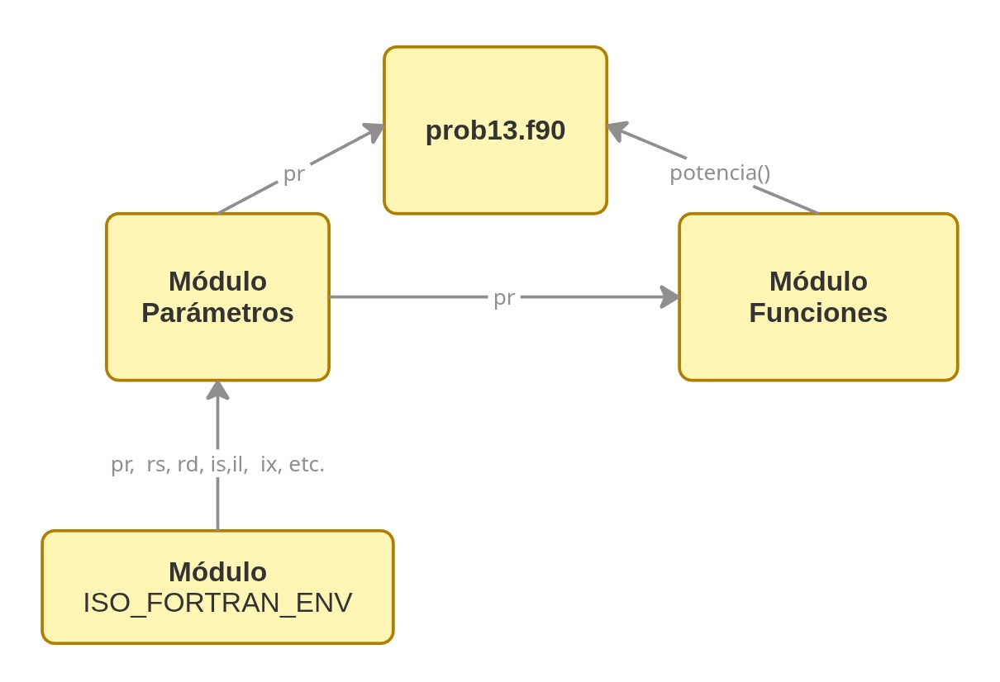

# Ejemplo simple de módulos en Fortran

Este documento contiene un ejemplo muy simple de uso de módulos en Fortran, incluyendo un módulo de parámetros y un módulo genérico de funciones.

Lo módulos tienen por objeto la modularización (valga la redundancia) del código. En este ejemplo uno podría incluir simplemente todo en el código principal en `prob13.f90`, pero sin embargo lo haremos de manera que nos quede una estructura que puede ayudarnos a construir un código más legible para nosotros y para otros. 

## Estructura de archivos

- `module_parametros.f90`
- `module_funciones.f90`
- `prob13.f90`

---

## prob13.f90

Veamos el siguiente código:

```fortran
program potencias
use parametros
use funciones
implicit none

real(pr)                :: x, pot


print*, 'Ingrese el numero real:'
read(*,*) x

pot=potencia(x,5)

write(*,*) 'Potencia ',5,' de ',x,' =',pot

end program potencias
```
Es bastante claro. Un par de cosas quedan indefinidas. `use parametros`, `use funciones` y la funcion `potencia(x,5)`. Tambien notemos que en la definicion de las variables `x` y `pot`, usamos `real(pr)` y no definimos explicitamente el valor del entero `pr`.
El secreto de todo esto esta en las lineas `use`. La estructura esta explicada en el diagrama siguiente:

---
## Estructura de modulos

El diagrama de abajo indica lo que pretendemos hacer. 



Ahora veamos que hay en cada módulo!
---

## module_parametros.f90

```fortran
module parametros
use ISO_FORTRAN_ENV

implicit none

integer(kind = int8), parameter :: is = int8, id = int16, il = int32, ix = int64
integer(kind = int8), parameter :: rs = real32, rd = real64, rl = real128
! s : Short, d : Double, l : Large, x : eXtralarge

!aquí elijo la precision
integer, parameter :: pr=rd

module parametros
```

---

## module_funciones.f90

```fortran
module funciones

use parametros

implicit none

contains 

function potencia(x,n) result(pot)
    implicit none
    real(pr)               :: pot
    real(pr),intent(in)    :: x
    integer,intent(in)     :: n
    integer                :: i

    pot=x
    do i=2,n
        pot=pot*x
    enddo

end function potencia

end module funciones
```

---

Bien, por ahora se entiende la idea, pero, como se compila todo esto para que funcione??

---

## Compilación en un solo comando

`gfortran module_parametros.f90 module_funciones.f90 prob13.f90 -o prob13.e`.

**EL ORDEN IMPORTA!**, ya que el modulo funciones utiliza el modulo parametros, por lo tanto primero va el archivo que contiene el modulo parametros. Luego va el de funciones, por que prob13 utiliza ese modulo, y por ultimo el código que realiza la función principal.

---

## Compilación paso a paso

1. Compilar módulos uno por uno:
   - `gfortran -c module_parametros.f90`
   - `gfortran -c module_funciones.f90`

   esto genera dos archivos `module_parametros.o` y `module_funciones.o`
2. Compilar el programa principal:
   - `gfortran -c prob13.f90`
   genera `prob13.o`
3. Enlazar todo (linkear):
   - `gfortran module_parametros.o module_funciones.o prob13.o -o prob13.e`
4. Ejecutar:
   - `./prob13.e`

> Con `gfortran` el orden importa: primero compilación (`-c`) de módulos, luego programa principal.
> 

---

## Notas clave

- `module`: define constantes y rutinas reutilizables y crea interfaces explícitas para las funciones y subroutinas.
- `use`: importa módulo a programa/subrutina.
- `implicit none`: buena práctica para forzar declaración de variables.
- `-c`: compila sin enlazar. Crea archivos `*.o`.
- `*.mod`: archivo generado internamente por el compilador para el `use`.

---

