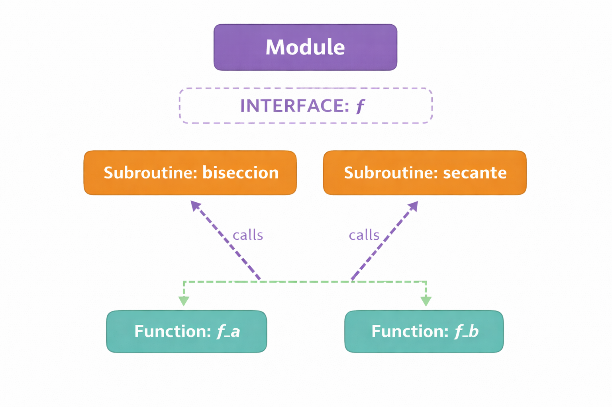

# Uso de Interfaces para Pasar Funciones como Argumentos en Fortran

## Resumen

En Fortran, una **interfaz abstracta** define la "firma" (tipo de entrada y salida) que debe tener una función para ser aceptada como argumento de una subroutine. Esto es análogo a las clases abstractas o prototipos de funciones en otros lenguajes.

---

## ¿Por qué necesitamos una interfaz?

Cuando queremos que una subroutine reciba **una función diferente cada vez que se la llama**, necesitamos especificar:
- Cuántos argumentos tiene la función
- Qué tipo de datos recibe (entrada)
- Qué tipo de dato devuelve (salida)

Por ejemplo, en métodos numéricos para encontrar raíces, queremos que `biseccion()` o `secante()` funcionen con **cualquier** función matemática, no una específica.

---

## Estructura General



### Paso 1: Definir la Interfaz Abstracta

Se define como una función dummy que especifica la firma esperada:

```fortran
module module_subs
    use parametros
    implicit none

contains

    ! Interfaz abstracta: define la firma que deben cumplir las funciones
    function interfaz_f(s) result(v)
        real(kind=pr), intent(in) :: s
        real(kind=pr)             :: v     
    end function interfaz_f

end module module_subs
```

**Nota importante:** Esta función NO tiene implementación. Solo define la estructura.

---

### Paso 2: Usar la Interfaz en la Subroutine

En la subroutine que recibirá una función, se usa `procedure`:

```fortran
subroutine biseccion(f, a, b, tol, tol_abs, unidad, pN, fpN, iter)
    implicit none
    procedure(interfaz_f) :: f    ! f es una función que cumple con interfaz_f
    real(kind=pr), intent(in)    :: a, b
    real(kind=pr), intent(in)    :: tol, tol_abs
    integer,       intent(in)    :: unidad
    real(kind=pr), intent(out)   :: pN, fpN
    integer,       intent(out)   :: iter

    ! ... resto de la implementación
    ! Dentro del código, se usa f normalmente:
    f_a = f(a)   ! evalúa la función en el punto a
    fp  = f(p)   ! evalúa la función en el punto p

end subroutine biseccion
```

**Clave:** `procedure(interfaz_f) :: f` declara que `f` debe cumplir con la interfaz abstracta.

---

### Paso 3: Implementar Funciones Concretas

Cada función concreta debe tener la misma firma que la interfaz (aunque puede tener otras variables internas):

```fortran
! Función 1: f(x) = x^2 - 1
function f_a(x) result(y)
    real(kind=pr), intent(in) :: x
    real(kind=pr)             :: y
    y = x**2 - 1.0_pr
end function f_a

! Función 2: f(x) = 2x - tan(x)
function f_b(x) result(y)
    real(kind=pr), intent(in) :: x
    real(kind=pr)             :: y
    y = 2.0_pr * x - tan(x)
end function f_b

! Función 3: f(x) = x^2 - 3
function f_c(x) result(y)
    real(kind=pr), intent(in) :: x
    real(kind=pr)             :: y
    y = x**2 - 3.0_pr
end function f_c
```

---

### Paso 4: Llamar a la Subroutine

Se pasa directamente el **nombre de la función**:

```fortran
program ejemplo
    use module_subs
    implicit none
    
    real(kind=pr) :: a, b, pN, fpN
    integer       :: iter, uid
    
    a = 0.0_pr
    b = 0.8_pr
    
    ! Llamada: se pasa f_a como argumento
    call biseccion(f_a, a, b, 1.0e-6_pr, 1.0e-8_pr, 10, pN, fpN, iter)
    
    ! O con otra función:
    call biseccion(f_b, a, b, 1.0e-6_pr, 1.0e-8_pr, 10, pN, fpN, iter)
    
contains

    function f_a(x) result(y)
        real(kind=pr), intent(in) :: x
        real(kind=pr)             :: y
        integer                   :: i,j,k
        y = x**2 - 1.0_pr
    end function f_a
    
    function f_b(x) result(y)
        real(kind=pr), intent(in) :: x
        real(kind=pr)             :: y
        y = 2.0_pr * x - tan(x)
    end function f_b

end program ejemplo
```

---


## Reglas Importantes 

1. **Firma exacta:** Las funciones concretas DEBEN tener exactamente los mismos:
   - Tipo de argumentos de entrada
   - Tipo de retorno
   - Atributos `intent` y `dimension`

2. **Nombre sin importancia:** El nombre de la función concreta (f_a, f_b, etc.) no importa, solo que cumpla la firma.

3. **Ubicación:** 
   - La **interfaz** está en el módulo
   - Las **funciones concretas** pueden estar en el programa principal o en el módulo

4. **Sin paréntesis:** Al pasar la función, se usa solo el nombre: `call biseccion(f_a, ...)`, no `call biseccion(f_a(), ...)`


---

## Errores Comunes

### ❌ Error 1: Firma no coincide
```fortran
! Interfaz define:
function interfaz_f(x) result(y)
    real(kind=pr), intent(in) :: x
    real(kind=pr)             :: y
end function

! Función concreta INCORRECTA:
function f_malo(x, tol) result(y)  ! ¡¡¡ EXTRA argumento !!!
    real(kind=pr), intent(in) :: x, tol
    real(kind=pr)             :: y
    y = sin(x)
end function f_malo
```

### ❌ Error 2: Pasar con paréntesis
```fortran
! INCORRECTO:
call biseccion(f_a(), a, b, ...)  ! ¡¡¡ NO usar paréntesis !!!

! CORRECTO:
call biseccion(f_a, a, b, ...)
```

### ❌ Error 3: Olvidar el `result`
```fortran
! PUEDE causar problemas:
function f_a(x)
    real(kind=pr), intent(in) :: x
    real(kind=pr) :: f_a
    f_a = x**2 - 1.0_pr
end function

! MEJOR (recomendado):
function f_a(x) result(y)
    real(kind=pr), intent(in) :: x
    real(kind=pr)             :: y
    y = x**2 - 1.0_pr
end function
```

---

## Ventajas de Usar Interfaces

 **Reutilidad:** Una subroutine funciona con muchas funciones diferentes  
 **Seguridad:** El compilador verifica que las propiedades de cada función coincidan  
 **Claridad:** Es explícito qué tipo de función se espera  
 **Mantenimiento:** Cambios en la propiedades se detectan en compilación  
 **Flexibilidad:** Permite código genérico y modular  

---

## Alternativa Antigua (NO recomendada)

En Fortran 77/90 antiguo, se usaba `external`:

```fortran
subroutine biseccion(f, a, b, ...)
    real, external :: f  ! ¡¡¡ NO dice qué tipo de argumento tiene f !!!
    ...
    fa = f(a)
end subroutine
```

**Problema:** No hay validación de tipos en compilación. ⚠️

**Solución moderna:** Usar `procedure(interfaz)` ✅

---
