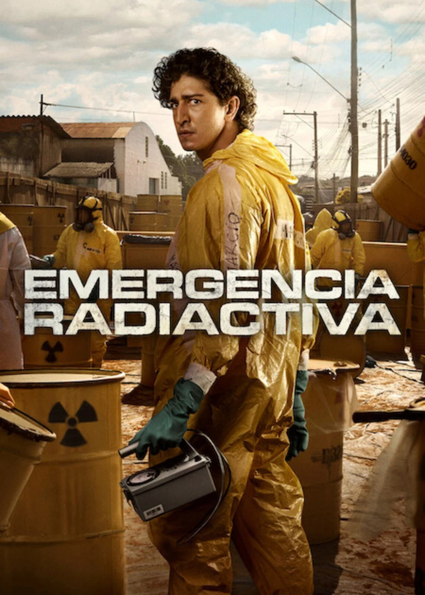
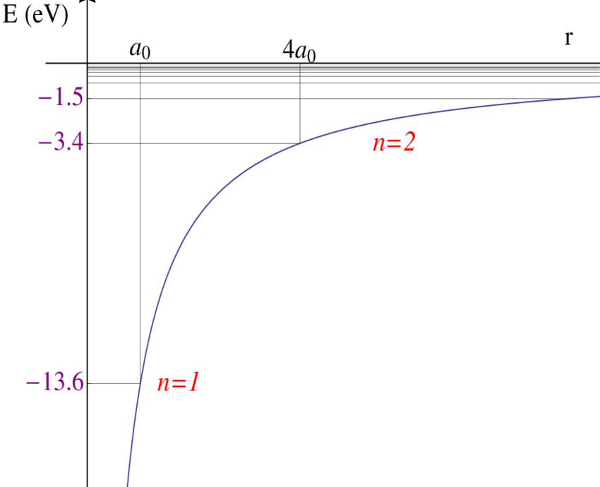
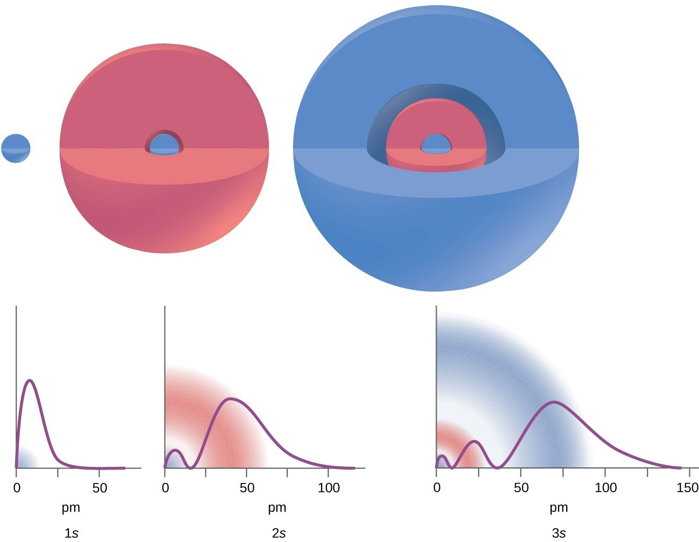
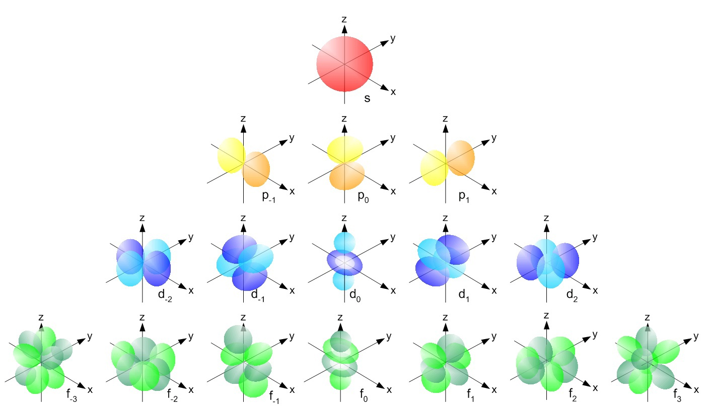
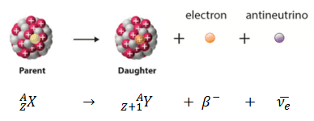
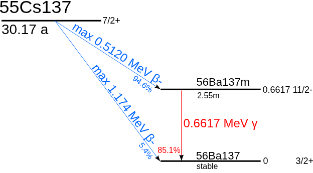
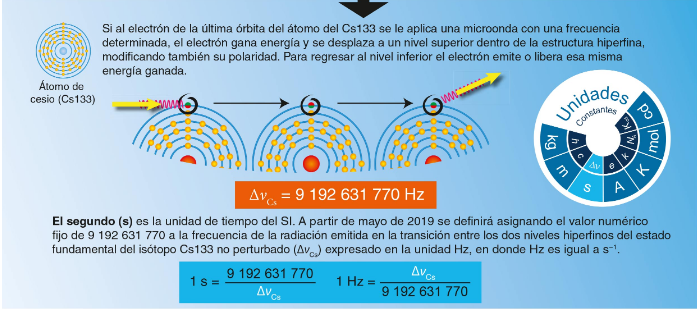

## Motivación

## Átomos

Consisten en un núcleo atómico de carga positiva rodeado por electrones de carga negativa. La energía potencial entre una carga positiva ($Z$) y negativa ($-e$) es (con la positiva localizada en el origen),

$$U(\vec{r})=-\frac{eZ}{|\vec{r}|}$$

Debido a la cuantización de los niveles atómicos los electrones tienen densidad probabilidad que responden a las simetrías del sistema.

Por otro lado existen muchos tipos de orbitales, dependiendo del estado que ocupemos y su valor de momento angular.

## Cesio 

Es un elemento químico (átomo) que tiene 55 protones (cargas positivas) en su núcleo y 78 neutrones (sin carga) en su isótopo estable. El átomo tiene 55 electrones.

- Configuración electrónica	[Xe] 6s1
- Electrones por nivel	2, 8, 18, 18, 8, 1

## Isótopos

Los isótopos son átomos del mismo tipo, misma cantidad de protones, pero con diferente cantidad de neutrones,

| Isótopo             | AN        | Período                 | MD                       | Energía (MeV) | Producto de decaimiento                  |
| ------------------- | --------- | ------------------------ | ------------------------ | ------------- | ---------------------------------------- |
| $^{133}\mathrm{Cs}$ | 100 %     | Estable con 78 neutrones | —                        | —             | —                                        |
| $^{134}\mathrm{Cs}$ | Sintético | 2,0648 años                 | $\varepsilon$, $\beta^-$ | 1,229 ; 2,059 | $^{134}\mathrm{Xe}$, $^{134}\mathrm{Ba}$ |
| $^{135}\mathrm{Cs}$ | Trazas    | $23\times10^6$ años         | $\beta^-$                | 0,269         | $^{135}\mathrm{Ba}$                      |
| $^{137}\mathrm{Cs}$ | Sintético | 30,07 años                  | $\beta^-$                | 1,176         | $^{137}\mathrm{Ba}$                      |

El período de la tabla indica cada cuanto la actividad baja a la mitad.

## Decaimiento $\beta^-$

$$n→p+e⁻+\nu⁻_e​$$

## Cadena del ${}^{137}$ Cs

Primero tenemos un decaimiento $\beta^{-}$

$${}^{137} Cs\rightarrow {}^{137m}Ba + e^{−} +\nu^{-}_e​$$

Luego el Bario queda excitado, con lo que,

$${}^{137m} Ba\rightarrow {}^{137} Ba+ \gamma$$

El fotón gamma tiene una energía de aproximadamente $662 keV$, y esa es la radiación útil terapéuticamente para tratamiento de cancer. En términos de niveles de energía se tiene,

## Otro uso de los niveles del Cesio: Definición del segundo.

## Tabla decaimiento (E. Bellotti et.al. "Search for time dependence of the 137Cs decay constant",Physics Letters B,Volume 710, Issue 1, (2012),Pages 114-117,)

| Tiempo desde inicio | Actividad medida (Bq) |
| ------------------- | --------------------: |
| 0 días              |                  3000 |
| 30 días             |                  2994 |
| 60 días             |                  2989 |
| 90 días             |                  2983 |
| 120 días            |                  2977 |
| 150 días            |                  2971 |
| 180 días            |                  2966 |
| 217 días            |                  2959 |

La actividad son las cantidad de desintegraciones por segundo (1 Becquerel= 1 Desintegración/s).

